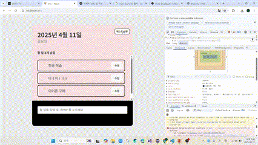

# TodoList

## useMemo 사용
- TodoHead.jsx에서 할 일의 개수가 변경되었을 경우에만 렌더링이 일어나도록 기존 할 일 개수를 나타내던 undoneTasks를 undoneCount로 변경

## useCallback 사용
- TodoItem.jsx에서 사용하던 onToggle, onRemove, onEdit를 TodoList.jsx 파일에서 useCallback을 이용하여 TodoItem.jsx에 props로 전달하도록 변경

### 성능 전후 비교
- React dev tools로 확인하였을 때는 변화한 점이 없지만 item의 개수가 매우 많아진다면 성능에서 차이가 보였을 것이라 생각합니다.